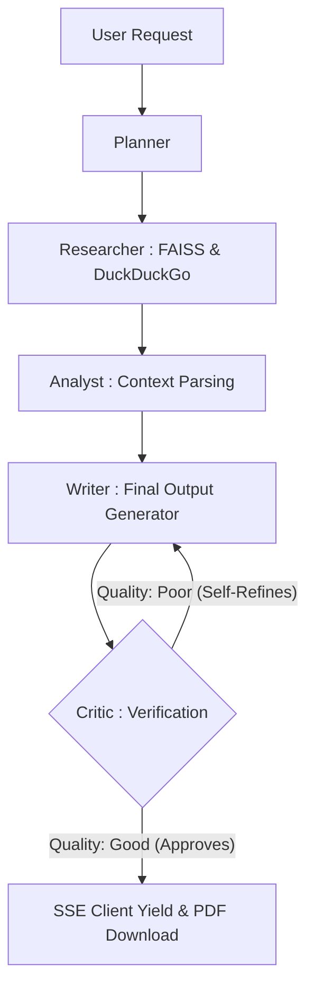

<div align="center">
  

  <h1>AutoResearch AI — <i>Studio Protocol v5.0</i></h1>
  <p><b>Hyper-Precision Multi-Agent Orchestrator • 100% Local Inference • GPU Accelerated</b></p>

  <p>
    <a href="https://github.com/maqa817/AutoResearch_AI"></a>
    <a href="https://github.com/maqa817/AutoResearch_AI"></a>
    <a href="https://github.com/maqa817/AutoResearch_AI"></a>
    <a href="https://github.com/maqa817/AutoResearch_AI"></a>
    <a href="https://github.com/maqa817/AutoResearch_AI"></a>
  </p>
</div>

---

## ⚡ Overview

**AutoResearch AI** is a professional-grade, fully local multi-agent system designed for researchers, security-conscious professionals, and enterprises. It handles **document ingestion, semantic indexing, query orchestration, report generation, and verification** while guaranteeing **zero data leakage**.You can review the frontend part (because Ollama is running locally and I don’t have any paid partnership with hosting websites) at https://autoresearchai.vercel.app/ .

> Built to combine the high-performance aspects of Mistral and Llama models with GPU acceleration and robust agent collaboration.

---

## 🚀 Multi-Agent Pipeline

Each query flows through **5 specialized autonomous agents**, ensuring high precision and minimal hallucination:

| Agent          | Compute Type        | Responsibility                                                             |
| :------------- | :------------------ | :------------------------------------------------------------------------- |
| **Planner**    | Sequential Logic    | Breaks prompts into atomic actionable steps                                |
| **Researcher** | Semantic GPU Search | Embeds queries & documents via `all-MiniLM-L6-v2`                          |
| **Analyst**    | Data Abstraction    | Converts raw textual chunks into structured insights                       |
| **Writer**     | Markdown Synthesis  | Generates human-readable reports with structure & citations                |
| **Critic**     | Verification        | Scores output quality, rejects hallucinations, ensures factual correctness |

---

## 🖥️ System Architecture

* **Backend**: FastAPI + Python 3.10+
* **Frontend**: React 18 + Vite (premium 12-column luxury grid)
* **Vector DB**: FAISS (local, memory-mapped, scalable to millions of chunks)
* **Web Search**: Integrated DuckDuckGo Search Protocol
* **LLM**: Ollama running Mistral-7B / Llama 2-7B locally
* **Hardware**: GPU-aware (NVIDIA RTX 40xx series), fallback to CPU

```python
# Embedding device allocation
self.device = "cuda" if torch.cuda.is_available() else "cpu"
self.model = SentenceTransformer("all-MiniLM-L6-v2", device=self.device)
```

---

## 📊 Performance Benchmarks

| Model      | Target Device | Avg Response / Chunk | Use Case                               |
| :--------- | :------------ | :------------------- | :------------------------------------- |
| Mistral-7B | RTX 4060 Ti   | 1-2s                 | High-precision document analysis       |
| Llama 2-7B | RTX 4060 Ti   | 2-3s                 | Offline research, long-context queries |
| CPU-only   | CPU fallback  | 5-10s                | Prototyping, small datasets            |

> GPU acceleration reduces response time by 70–80%. CPU-only mode remains functional but slower.

---

## 🛠️ Installation

### 1. Prerequisites

* [Python 3.10+](https://www.python.org/downloads/)
* [Node.js v18+](https://nodejs.org/en/)
* [NVIDIA CUDA Toolkit](https://developer.nvidia.com/cuda-downloads)
* [Ollama Local](https://ollama.com)

```bash
# Launch Ollama LLM
ollama run mistral
# or
ollama run llama3
```

### 2. Backend Setup

```bash
cd backend
python -m venv venv
.\venv\Scripts\activate
pip install -r requirements.txt

# CRITICAL: Install CUDA-accelerated PyTorch for RTX GPU support
# This enables the "device: CUDA" mode for lightning-fast document embeddings
pip install torch torchvision torchaudio --index-url https://download.pytorch.org/whl/cu121 --force-reinstall

uvicorn main:app --reload --port 8000
```

### 3. Frontend Setup

```bash
cd ..
npm install
npm run dev
```

Visit: `http://localhost:3000`

---

## 🔐 Data Sovereignty

* All files (`.txt`, `.pdf`) are hashed and vectorized **locally**
* No external cloud or telemetry
* Critic agent ensures factual correctness

---

## 🌟 Advanced Features

* **Autonomous Self-Refinement**: The Critic agent runs verification on generated outputs. If quality hits a threshold of "poor" or hallucinations are detected, the Orchestrator safely loops back to a `"Re-Writer"`, guaranteeing quality assurance autonomously.
* **Live Citation Explorer**: A native "Glass-box" RAG frontend component that maps exact FAISS embedding chunks directly to the UI, allowing verification of AI claims against raw similarity scores.
* **Professional PDF Report Export**: Single-click conversion of markdown synthesis into stylized, highly-structured executive white-paper PDFs complete with generated headers and multi-page calculations entirely done natively.
* **Structured PDF & OCR Heuristics**: Integrated `pdfplumber` to bypass bad PyPDF2 parsing. Extracts exact row/column structures for tables, and flags unstructured/scanned images for Vision-model OCR fallback automatically.
* **Real-Time Token Streaming**: Consume inference results as they happen via Server-Sent Events (SSE).
* **Deep Web Augmentation**: Real-time integration with **DuckDuckGo API** to supplement local document analysis with the latest web data.
* **Agentic Research Trace**: Watch the Planner, Researcher, Analyst, Writer, and Critic collaborate in a live-updating backtrace timeline.
* **Strict Context Control**: Absolute document filtering ensures the AI only accesses files you explicitly select for each query.
* **Hardware acceleration**: Deep integration with NVIDIA RTX GPUs via Ollama and PyTorch (CUDA).
* **Fully air-gapped**: Zero external data transmission for 100% privacy.

---

## 🔮 Future Enhancements

* Native `Llava` multi-modal offline interaction for extracting tables from the scanned heuristic pipeline.
* Semantic query routing and query decomposition.
* Persistence layer for research history and user sessions.

---

## 📌 Example Query

**Query:**
*"Summarize specifically from Document_1.txt and ignore the database."*

**AI Response:**
*"Synthesized report exclusively based on Doc_1: Insights found include X, Y, and Z. Reference vectors from other files were excluded as per strict selection protocol."*

---

## 📈 Multi-Agent Architecture (Mermaid)


---

## 📊 Hardware vs Performance Table

| Task           | Device      | Avg Time         | Notes               |
| :------------- | :---------- | :--------------- | :------------------ |
| Vectorization  | RTX 4060 Ti | 3-5ms/chunk      | 250-word overlap    |
| FAISS Search   | CPU         | <1ms             | 1M+ vectors         |
| LLM Generation | RTX 4060 Ti | 30-55 tokens/sec | 8,000 token context |

---

<div align="center">
Built with ❤️ by <a href="https://github.com/maqa817">Maqa Verdiyev</a> — connect via <a href="https://www.linkedin.com/in/maqa-verdiyev/">LinkedIn</a>
</div>
